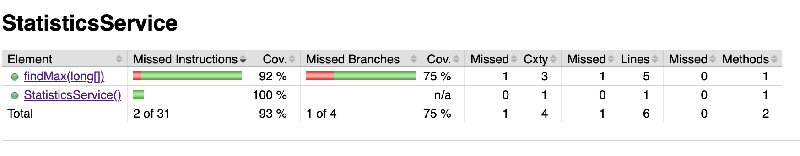
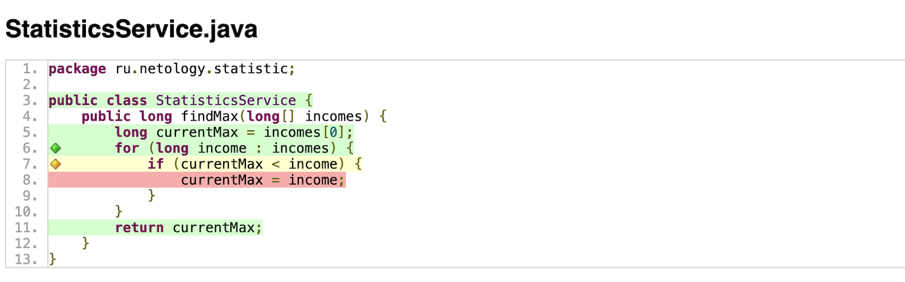
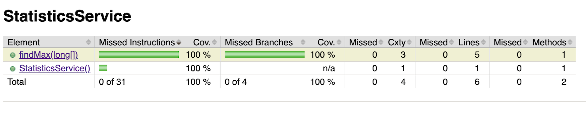
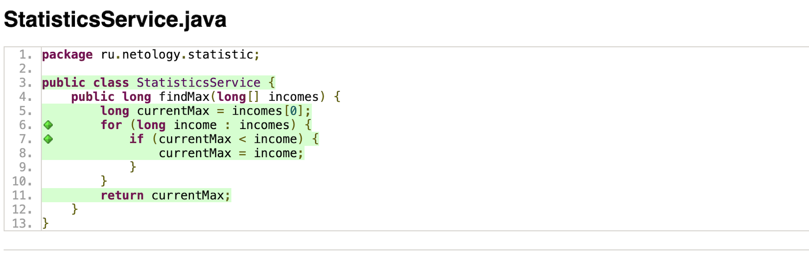

***Практикумы Нетологии по Java***

## Задание

Настроить CI на основе GitHub Actions и проанализировать отчет покрытия кода тестами с использованием плагина JaCoCo Maven.

_Исходные данные_

Код сервисного класса:
```
package ru.netology.statistic;

public class StatisticsService {
    public long findMax(long[] incomes) {
        long currentMax = incomes[0];
        for (long income : incomes) {
            if (currentMax < income) {
                currentMax = income;
            }
        }
        return currentMax;
    }
}
```

И код тест-класса, который его тестирует:

```
package ru.netology.statistic;

import org.junit.jupiter.api.Test;
import org.junit.jupiter.api.Assertions;

public class StatisticsServiceTest {

  @Test
  void findMax() {
    StatisticsService service = new StatisticsService();

    long[] incomesInBillions = {12, 5, 8, 4, 5, 3, 8, 6, 11, 11, 12};
    long expected = 12;
    long actual = service.findMax(incomesInBillions);

    Assertions.assertEquals(expected, actual);
  }
}
```

Необходимо:
* создать Maven-проект с данными класссами, запустить `mvn clean test` и убедиться, что тесты проходят;
* настроить CI на основе GitHub Actions;
* добавить в проект JaCoCo и настроить его в режиме обрушения сборки по недостаточному покрытию, а именно 100% покрытие по счётчику BRANCH;
* запустить `mvn clean verify` и убедиться, что сборка упадёт из-за недостаточного покрытия;
* проанализировать сгенерированный отчёт по покрытию, дописать недостающие тесты для полного покрытия, сам сервисный класс трогать нельзя;
* убедиться, что сборка на ГитХабе проходит.

**Ход выполнения и результаты:**

1. Создаем проект на базе Maven и сервисный класс [`StatisticsService`](https://github.com/SvetlanaKh-1/StatisticsService/blob/master/src/main/java/ru/netology/statistic/StatisticsService.java).
2. Создаем тестовый класс [`StatisticsServiceTest`](https://github.com/SvetlanaKh-1/StatisticsService/blob/master/src/test/java/ru/netology/statistic/StatisticsServiceTest.java).
3. Запускаем тесты с помощью `mvn clean test` и убеждаемся что тест запускается и проходит.
4. Указываем настройки CI на основе GitHub Actions в файле [maven.yml](https://github.com/SvetlanaKh-1/StatisticsService/blob/master/.github/workflows/maven.yml) для автоматической проверки сборки и проведения тестов на GitHub.
5. Добавялем в проект плагин JaCoCo и настраиваем его в режиме обрушения сборки по недостаточному покрытию, а именно 100% покрытие по счётчику BRANCH.
6. Запускаем `mvn clean verify` и видим по отчету, что сборка падает из-за недостаточного покрытия тестами кода:

Осталось непокрытым условие, `if (currentMax > income)` и не отработана строка кода при данном условии `currentMax = income;`
.
7. Дописываем необходимый тест для прогона кода по данной ветке пути и запускаем `mvn clean verify`. Убеждаемся, что тесты и сборка проходят. Проверяем отчеты по покрытию кода тестами:


8. Делаем push коммитов в GitHub и убеждаемся, что проверка CI в GitHub Actions также проходит успешно. 